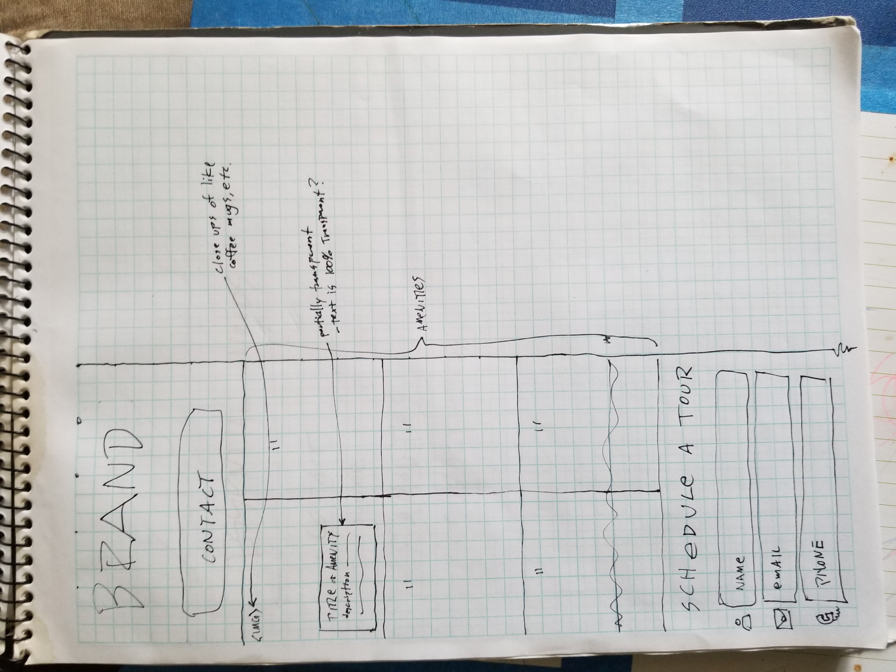
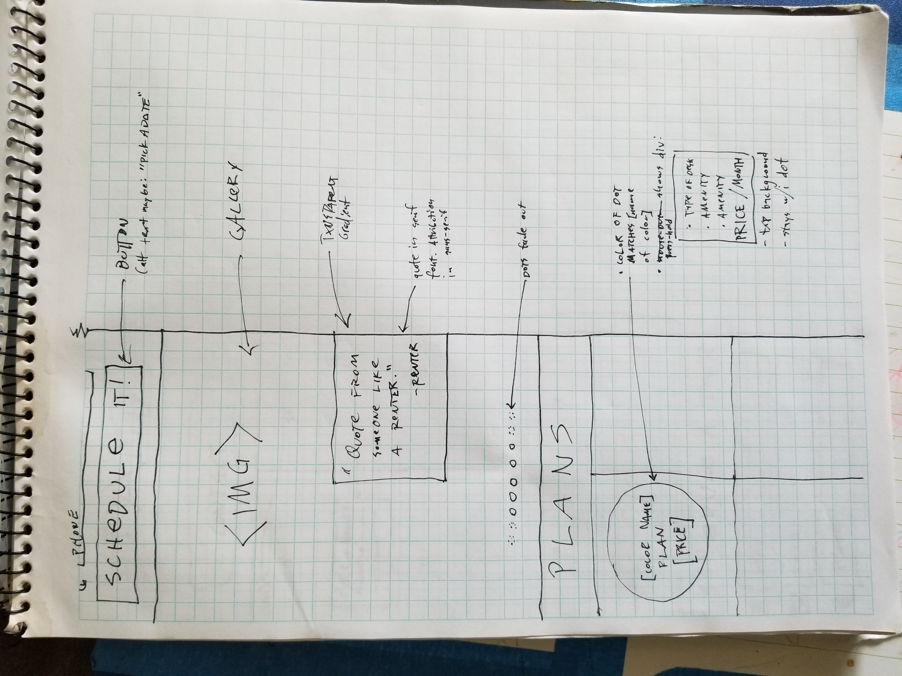
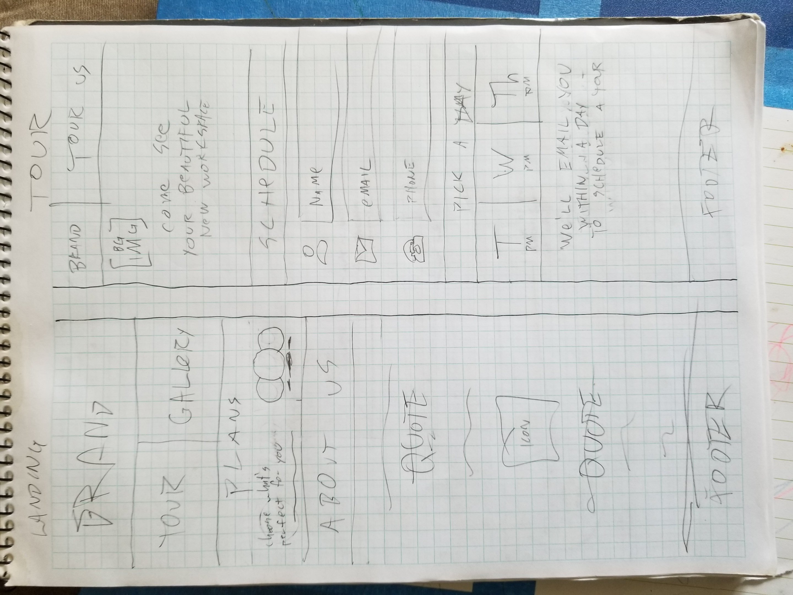
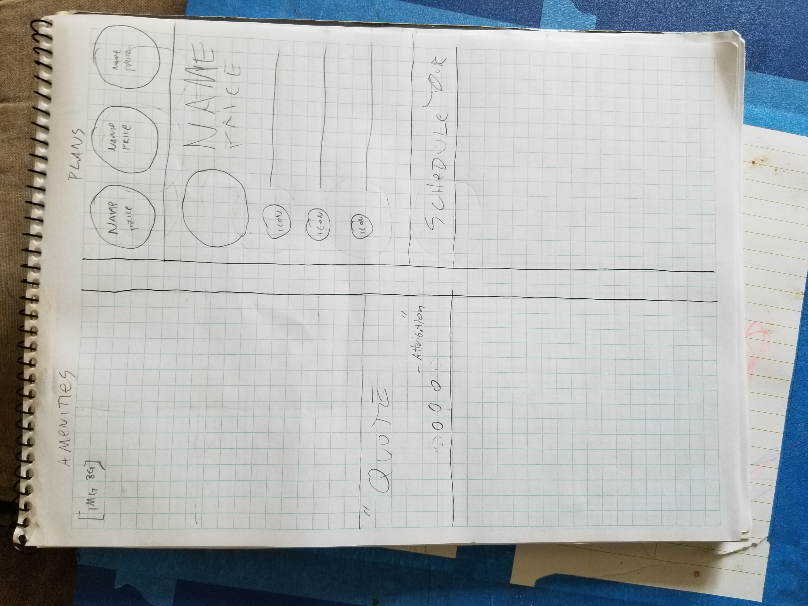

# Co-Working Space Freelance Project

#### A site for a fictional co-working space, September 14, 2018

#### By Josh Gearheart

## Description
This is a site design project for a fictional co-working space.  It includes photos of paper sketches, wireframes and prototypes in Sketch, and...

## Design Process

****

### User Stories

- As a prospective customer,
  I need to be understand what this space offers at what price,
  so that I can decide whether or not to rent space there.
- As a prospective customer,
  I need to be able to contact the business,
  so that I can rent space there.
****
- As a current customer,
  I need the ability to see and edit my current rental agreement,
  so that I can change my rental plan or cancel my rental if I choose.
- As a business owner,
  I need to see details of ,
  so that I can decide whether or not to rent space there.

### Inspirational websites

- http://deskandmug.com/
- https://collectiveagency.co/
- http://owltastic.com/
- http://www.ostrolucky.com/en
- http://oivo.pw/

- Also I took inspiration from [this album cover](img/bama.jpg), based on the client's desires "to feel a little luxurious, cool, and high-end; yet still 100% welcoming and inclusive to everyone".  I find this design and font layout so pleasing.  It feels modern, classy, and classic all at the same time, while having a richness that makes you feel comforted.

### Paper sketches

#### Brainstorm Sketches Inspired by Desk & Mug

#### First Draft Sketches

#### Fonts Used

- Raleway
- Montserrat
- Abril Fatface
- Londrina Outline

## Setup/Installation Requirements
- 

**OR**
- Navigate to `https://github.com/gearjosh/co-work-client`.
- Click the green `Clone or download` button on the right, and select `Download ZIP`.
- Unzip `co-work-client-master.zip`.
- Navigate to the `co-work-client-master` directory.
- Inside  double-click on `index.html`.

## Known Bugs
- There is no site yet, as I am still in the design phase, so don't be surprised if `index.html` doesn't work. ;)

## Support and contact details
- For questions or support you can email me at: comedian.sean.connery@gmail.com.

## Technologies Used
- ~~This site uses HTML and CSS.~~
- This uses my phone's camera, and Sketch so far.

### License
This ~~software~~ is licensed under [GNU GPLv3](LICENSE.txt).
